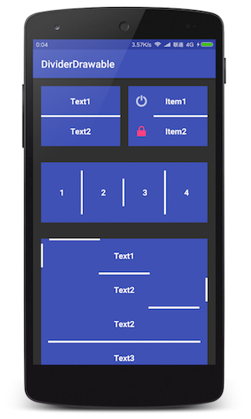

# DividerDrawable
[](http://www.apache.org/licenses/LICENSE-2.0.html) [](https://jitpack.io/#nekocode/DividerDrawable)

This library can help you easily layout and draw dividers on existing views. For better performance, don't create new views for drawing dividers anymore, use drawable instead.



## Install

```gradle
repositories {
    maven { url "https://jitpack.io" }
}
dependencies {
    compile 'com.github.nekocode:DividerDrawable:{lastest-version}'
}
```


## Usage

Obtain a new `DividerDrawable` instance. And setup the layout params for divider.

```java
DividerDrawable dividerDrawable = new DividerDrawable(paint);
dividerDrawable.getLayout()
        .setOrientation(DividerLayout.ORIENTATION_VERTICAL)
        .setAlign(DividerLayout.ALIGN_PARENT_BOTTOM)
        .setCenter(DividerLayout.CENTER_HORIZONTAL)
        .setMarginBottomDp(20);
```

You can use `DividerUtils` to easily combine the divider drawable to your existing backgroud drawable.

```java
DividerUtils.addDividersTo(textView, dividerDrawable);
```

If you changed the divider's layout params, don't forget to notify the changes.

```java
dividerDrawable.notifyLayoutChanged();
```